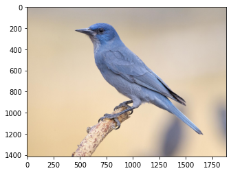
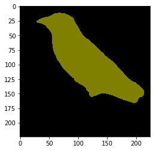

# Image Segmentation with PyTorch
This repo contains the code for image segmentation using FCNs, implemented using Pytorch.

An example after segmentation is given here:

### Input Image

### Segmented Output Image
